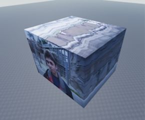

# VideoCube


Converts a video into a series of textures to be applied to the surfaces of a cube, where depth of the cube represents time, using OpenCV.

Some example textures using [Me at the zoo](https://www.youtube.com/watch?v=jNQXAC9IVRw) video can be found under the `examples` directory.



## Usage

```bash
py . <input> <output_dir> [prefix]
```

This will create six images named in the format `[prefix][face].png`, e.g `left.png`.

