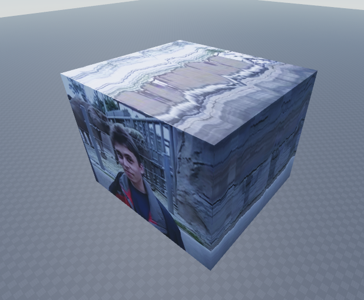

# VideoCube

Converts a video into a series of textures to be applied to the surfaces of a cube, where the cubes depth represents time, using OpenCV.



## Usage

```bash
py . <input> <output_dir> [prefix]
```

This will create six images named in the format `[prefix][face].png`, e.g `left.png`.
